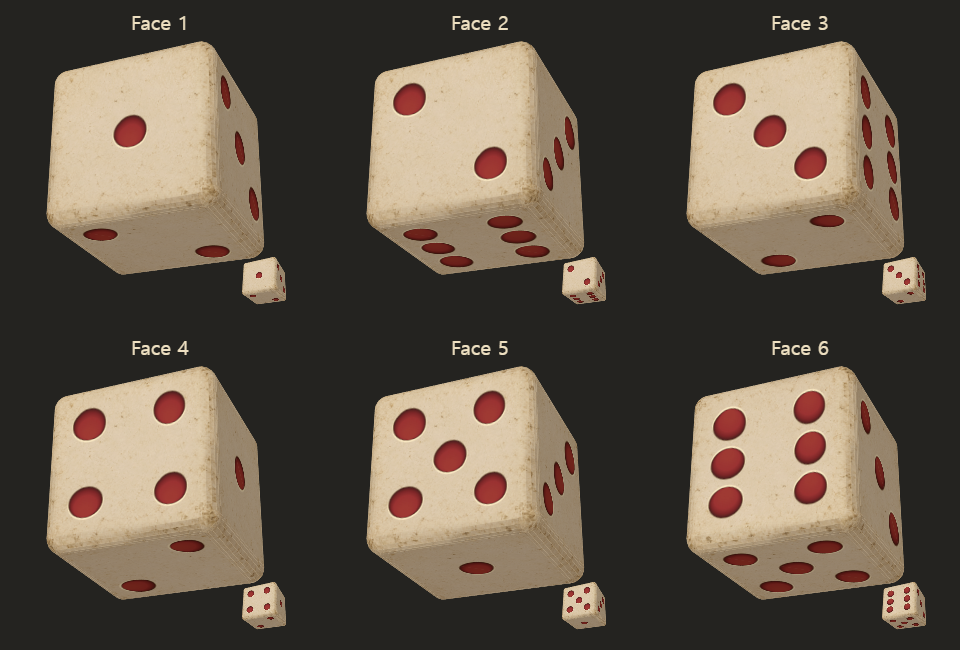

# 이전 주사위의 현실감을 살린 기본 육면체

v97은 사진 조각과 틈을 제거했지만 날카로운 윤곽, 균일한 표면과 작은 점 때문에 기존 주사위의 둥글고 묵직한 인상이 줄었다. 이번 수정은 이전 이미지의 둥근 모서리, 마모된 상아색 돌, 깊은 붉은 눈을 실제 회전하는 육면체에 되살린다.

## 재질과 형태

- 이전 `dice/dice-1.png`와 `dice/dice-6.png`를 참고해 번호 없는 돌 표면 한 장을 내장 이미지 생성으로 제작했다. 밝은 중심, 구석에 모인 때, 불규칙한 잔균열을 유지한다. [프롬프트](prompt.txt)와 [생성 원본](source.png), [생성 기록](generation.json)을 보관한다.
- [게임용 PNG](../../../dice/skins/ivory-worn/cube-surface-v98.png)는 512×512다. 추가 생성 요청은 1회이며 금액 정보는 도구가 제공하지 않았다. 별도 CLI/API 생성은 사용하지 않았다.
- 육면체에 반경 .18의 실제 둥근 모서리를 추가했다. 논리적인 결과 면은 여전히 6개이고 마주 보는 눈의 합은 7이다. 모서리용 면은 결과 후보에 들어가지 않는다.
- 큐브 바깥 크기는 기존 단위 상자 안에 유지한다. 표면 좌표는 오브젝트 공간에 고정되고, 면의 법선과 카메라 위치로 가시면을 선택한다. 모서리는 보간된 법선으로 부드러운 명암을 만든다.
- 중앙의 큰 주사위와 한 번 굽는 아이콘은 6분할 곡면을 사용한다. 매 프레임 그리는 작은 HUD 슬롯은 3분할 곡면을 고정해서 사용하며, 굴리는 중 역할이나 메시가 바뀌지 않는다.
- 눈은 v97보다 반경을 약 21.5% 키우고 검붉은 안쪽 벽, 넓고 차분한 붉은 바닥, 얇은 돌 테두리로 표현했다. 눈 전체는 주요 평면의 UV 영역 안에 남는다.
- 주요 면의 내부 삼각형만 충분히 겹쳐 눈 위 대각선 틈을 제거한다. 바깥 윤곽은 둥근 메시의 투영 경계로 클립한다.
- 손패·드래그·정보·상점 아이콘은 같은 큐브에서 생성된다. 다른 주사위의 기존 재질·번호와 보상·확률·정착 로직은 유지한다. 큐브 재질 로드 실패 시 공통 상아색 재질을 사용한다.

게임·콘텐츠는 v98이다. 기존 공통 재질은 v96을 유지하고 새 큐브 표면만 v98로 로드한다.

## 재현과 검사

```sh
node tools/art-review/cube-realism-98/rebuild.mjs
node tools/cube-geometry-test.cjs
node tools/dice-rotation-test.cjs
```

기하 검사는 실제 `game.js`의 메시·눈 배치를 추출한다. 모든 경계가 정확히 두 면에 연결되는지, 면이 바깥쪽을 향하는지, 둥근 상자 범위를 유지하는지, UV가 퇴화하지 않는지, 눈과 돌 테두리가 잘리지 않는지 검사한다. 실제 브라우저 검사는 `gen/cube-realism-check.cjs`로 실행하고 결과는 `gen/e2e/cube-realism/`에 보관한다.

시안 보드는 실제 렌더러에 읽기 전용 진단 export를 추가해 만든다. 최종 게임 검증은 수정하지 않은 실제 HTTP 코드와 이미지로 실행한다.

## 최종 검증 결과

검증한 `game.js` SHA-256은 `d915497e67642b8c2131078a3c416146d0bfbf3aed8913752efdf085b7973c08`이다. [요약](evidence/final-summary.json), [브라우저 관측](evidence/browser.json), [기하 검사](evidence/geometry.json), [파일 기록](evidence/manifest.json)을 보관한다.

- 휴대폰 화면 440×956, 데스크톱 1240×860에서 각각 1~6눈의 회전, 표면 좌표, 정착 결과, 손패·드래그·정보·상점 아이콘을 확인했다. 페이지 오류와 이전 `dice-1.png`~`dice-6.png` 요청은 0건이다.
- 실제 그리기 횟수로 24개 회전·정착 포즈에서 슬롯 3분할과 중앙 6분할을 확인했다. 두 메시의 주요 6면·눈 위치·표면 좌표는 동일하고 모든 경계가 맞물린다.
- 다른 8종 주사위의 재질과 투영 좌표는 두 화면에서 16건 모두 유지됐다. [회전 회귀 1281건](evidence/rotation.log), [손실·중복 차감 방지 검사](evidence/dice-loss.log), [웹 빌드](evidence/build.log)가 통과했다.
- 최종 실제 게임 캡처를 육안으로 확인했다. 작은 슬롯에서 베벨 줄무늬나 모서리 잘림이 두드러지지 않고, 여섯 면의 눈이 분리되어 읽힌다. 붉은 눈은 홈으로 보이며 중앙 회전에서도 면 사이에 대각선 틈이 보이지 않는다.
- [성능 측정](evidence/performance.json): 슬롯과 중앙 한 쌍의 Canvas 명령 제출 시간 p50/p95는 데스크톱 5.1/6.2ms, 휴대폰 화면 에뮬레이션 4.4/5.1ms였다. 실제 휴대폰 하드웨어나 GPU 완료 시간의 측정은 아니다. 캐시는 52개 캔버스·약 7.45MiB로 반복 중 늘어나지 않았다.



[휴대폰 실제 게임 전후 비교](evidence/before-after-phone.png) · [데스크톱 전후 비교](evidence/before-after-desktop.png) · [상점 아이콘](evidence/shop-phone.png)
