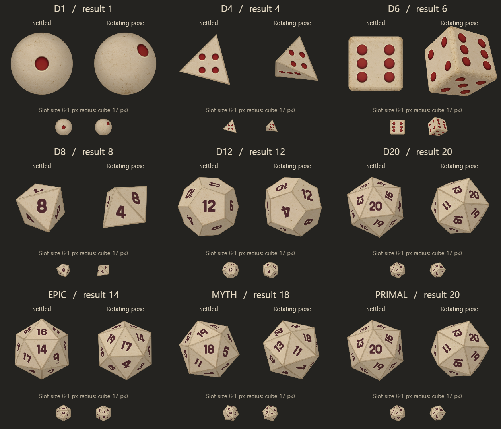
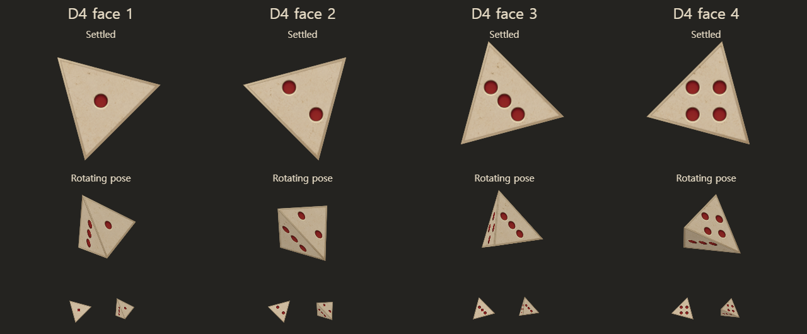

# 모든 주사위의 낡은 상아색 재질 통일

v98에서 승인한 육면체의 낡은 상아색 표면을 D1, D4, D6, D8, D12, D20과 epic·myth·primal 주사위에 공유한다. [기존 생성 재질](../../../dice/skins/ivory-worn/cube-surface-v98.png)을 그대로 사용하므로 추가 이미지 생성은 0회다. [원본·프롬프트·생성 기록](../cube-realism-98/generation.json)은 기존 제작 기록에 남아 있다.

## 표시 규칙

- D1은 구의 표면에 파인 붉은 눈 한 개를 표시한다. 눈과 돌결이 함께 회전한다.
- D4는 기존 숫자 1~4 대신 해당 개수의 붉은 눈을 표시한다. 대각선 2눈·3눈, 사각형 4눈을 삼각형 면의 내접원 안에 배치한다. 눈의 돌 테두리와 면의 가장자리 사이에 여유를 둔다.
- D6의 여섯 눈 배치와 둥근 입체 형태는 유지한다.
- D8, D12, D20 및 이를 사용하는 상위 등급은 숫자를 유지한다. 기존 6·9 구분 표시도 유지한다.

중앙 주사위, 슬롯, 손패, 드래그, 정보, 상점은 동일한 재질 생성 경로를 사용한다. 공통 이미지 키를 공유하여 같은 PNG를 중복 로드하지 않는다. 눈의 홈 표현도 공통 함수로 통일한다. 확률·보상·면 배치·정착 자세는 바꾸지 않는다.

D1의 눈을 확대했을 때 보였던 대각선 이음선은 구면 내부 삼각형을 겹쳐 그려 보정했다. 구의 바깥 윤곽은 기존 원형 클리핑을 유지한다.

콘텐츠와 게임 스크립트는 v99이며, 이미지 자체의 바이트와 v98 URL은 유지한다.

## 재현

```sh
node tools/dice-skin-contract-test.cjs
node tools/cube-geometry-test.cjs
node tools/dice-rotation-test.cjs
node tools/build-www.mjs
```

## 검증

최종 `game.js` SHA-256: `a5e43fbf82d8dd01ecc2e5c26d03833769923736dcfd272ae21f6405b57436e4`.

- 실제 재질 생성 함수의 Canvas 명령과 기하 검사: D1 1눈, D4 합계 10눈, D6 기존 21눈, D8·D12·D20의 숫자 40면을 확인했다. D4의 눈과 돌 테두리·면 가장자리까지 포함한 최소 여유는 원본 텍스처에서 약 0.98px다.
- 승인된 PNG 한 개만 요청하며, 캐시 52개·7,815,168bytes를 유지한다. 알 수 없는 스킨은 기본 스킨으로 처리하고 재질 생성에서 난수를 사용하지 않는다.
- 표면 좌표 112개, 둥근 큐브 기하, 기존 회전 회귀 1,281건, 웹 빌드를 통과했다.
- 실제 HTTP 게임으로 휴대폰 화면 440×956과 데스크톱 1240×860에서 각각 9종의 회전·정착을 확인했다. D4의 1~4 결과도 두 화면에서 모두 확인했으며, D1·D4 이미지에는 숫자가 없고 각 개수의 원형 붉은 눈이 관측됐다. D8 이상에는 숫자가 유지됐다.
- 손패·드래그·타워 정보 아이콘 18건과 두 화면의 상점 이미지를 확인했다. 손패와 타워의 아이콘은 기존처럼 획득한 결과 값에 따라 표시하며, 굴린 종류를 별도로 저장하도록 바꾸지 않았다. 새 재질 하나만 HTTP 200으로 로드됐고 페이지 오류는 0건이다.

[재질 계약 검사](evidence/material-contract.json) · [큐브 기하](evidence/geometry.json) · [회전 검사](evidence/rotation.json) · [빌드](evidence/build.log)

[실제 게임 검증](evidence/browser.json) · [모바일 게임 캡처](evidence/all-nine-phone.png) · [PC 게임 캡처](evidence/all-nine-desktop.png) · [상점](evidence/shop-phone.png)

아래 보드는 실제 게임 렌더 함수에 읽기 전용 export를 추가해 만든 진단 시안이다. 선택한 정착 자세·회전 자세와 실제 슬롯 크기를 비교하며, 자연스러운 전체 굴림 과정의 영상이나 게임 화면 캡처는 아니다.




