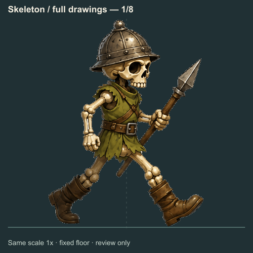
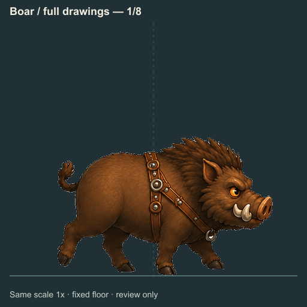

# PR #29 — 전신 애니메이션 시안 전체 보관

이 폴더는 **W2 해골·W6 멧돼지의 전신 작화 실험 자료**다. **완성된 8프레임 걷기 합격본은 0개**이며, 현재 게임의 걷기 자산을 교체하거나 새 보행을 검증한 결과가 아니다. 기존 게임 보행과 그 검증은 [이전 보행 기록](../pr29-gait/README.md)에 있다.

## 포함한 자료

- `sources/`: 이미지 생성 원본 **10개**, 원본 PNG 바이트 그대로. 최초 전체 시트 2개, 자세 가이드 기반 전체 시트 2개, 개별 전신 자세 6개다.
- `initial/`: 최초 시트 두 종에서 만든 투명 개별 프레임 **16개**, 투명 시트 **2개**, 번호가 있는 검토 시트 **2개**, 검토 GIF **2개**와 분할 설정·기록.
- `initial/seed-review/`: 흰 배경의 갇힌 틈을 확인한 원본 위 표시 이미지 2개와 후보 좌표 기록. 실제 사용한 수동 씨앗 좌표는 `initial/config.json`에 있다.
- `guides/`: 실제로 사용한 자세 가이드 보드 **PNG 2개·SVG 2개**, 각 보드에서 추출한 **도식 자세 PNG 16개**. 이 16개는 생성 지시용 도식이며 새 캐릭터 원화가 아니다.
- `references/`: 생성 입력으로 사용한 해골과 멧돼지 기준 이미지의 보관 사본 2개. 생성 원본 10개 수량에 포함하지 않는다.
- `records/`: 두 생성 목록의 원문 프롬프트·리뷰와 출처 목록. 초기 목록 2건이 최종 목록 10건에 다시 들어 있으므로 **12개 기록을 SHA 기준 원본 10개로 중복 제거**했다.

`helper-smoke`의 결과는 도구 시험을 위해 기존 분할본을 다시 가공한 중복 자료여서 포함하지 않았다. 이전에 이미 커밋한 완성형 중립 원화·리그 중립 합성본·비교 GIF는 [기존 원화 기록](../pr29-gait/README.md)에 연결하며 다시 복사하지 않았다.

## 생성 단계와 판정

- 최초 전체 시트: [W2](sources/w002-initial-sheet.png), [W6](sources/w006-initial-sheet.png). 해골은 두 번째 절반에 같은 다리 역할이 반복된다. 멧돼지는 몸통과 다리의 연결이 개선됐지만 앞다리 교대와 발 순서가 분명하지 않다.
- 가이드 기반 전체 시트: [W2](sources/w002-guided-sheet.png), [W6](sources/w006-guided-sheet.png). 도식의 다리 역할과 교대 순서를 일관되게 따르지 못해 완성 주기로 채택하지 않았다.
- 개별 해골 자세: [요청 자세 1](sources/w002-single-pose-01.png), [3](sources/w002-single-pose-03.png), [5](sources/w002-single-pose-05.png), [7](sources/w002-single-pose-07.png). 요청 번호일 뿐, 올바른 다리 역할을 충족했다는 인증은 아니다. 2·4·6·8 자세는 생성되지 않았다.
- 개별 멧돼지 자세: [요청 자세 1](sources/w006-single-pose-01.png), [3](sources/w006-single-pose-03.png). 한 장에서 앞발 들림은 확인했지만 두 장만으로 완성 보행을 구성할 수 없고, 다음 자세의 뒷다리 역할도 맞지 않는다.

[원문 프롬프트와 리뷰 10건](records/generations-latest.json) · [초기 기록 2건](records/generations-initial.json) · [상세 시각 검토](REVIEW.md)

아래 GIF는 **최초 시트의 부적합 시안을 그대로 검토하기 위한 반복 재생**이다. 서로 다른 8개 보행 단계가 완성됐다는 뜻이 아니다. 수동 기준점·고정 배율만 적용해 원화의 자세 반복과 남은 높이·체형 편차를 숨기지 않았다.




## 무결성 검증

저장소 루트에서 실행한다.

```sh
npm ci
node tools/art-review/pr29-fullbody/validate.mjs
```

[파일 목록](manifest.json)은 경로·분류·SHA256·이미지 크기와 GIF 프레임 정보를 기록한다. 검증기는 파일 누락·미등록 파일·해시 불일치, 실제 이미지 해독 실패, 검토 GIF의 8페이지 불일치, 원본 10개의 중복, 끊어진 기록 참조를 실패 처리한다. PNG/GIF는 원시 바이트 SHA를 사용하고, 텍스트는 Git의 LF/CRLF 차이만 정규화한 SHA를 사용한다. 목록 자체와 자기 참조를 피하기 위한 `evidence/validation.json`은 목록 해시에서 제외한다.

검증 결과는 기본적으로 `gen/pr29-fullbody-validation.json`에 쓴다. 보관 시점 결과는 [검증 기록](evidence/validation.json)에 있다. 파일·해시·해독 통과는 **아트 품질이나 걷기 합격 판정이 아니다**.

## 최초 시트 분할 재현

```sh
node tools/art-review/pr29-fullbody/rebuild-preview.mjs
```

출력은 `gen/pr29-fullbody-preview/`다. 원본 PNG에 지정한 수동 영역, 몸통 X 기준점, 바닥선과 공통 1배 배율로 재생성한다. 자동 무게중심 맞춤, 프레임별 높이·면적 배율 보정, 다리 변형은 하지 않는다. 같은 폭으로 자르면 잘리는 창끝·발·코를 보존하도록 빈 여백에 경계를 지정했다. 확인한 배경 틈만 씨앗 좌표로 제거한다.

PNG·GIF **22개를 재생성해 보관본과 SHA256 불일치 0개**를 확인했다. [재생성 기록](evidence/rebuild-verification.json). 이 검증은 저장된 원본을 분할·합성하는 과정에 한정되며, 비결정적인 이미지 생성 자체를 재현한다는 뜻이 아니다. 검토 글자 렌더링은 sharp/libvips와 설치 글꼴의 영향을 받을 수 있으므로 다른 환경에서도 출력 해시를 비교해야 한다.

가이드 보드의 제작 코드는 `guides/rebuild-boards.mjs`에 있으며 실행 시 `gen/pr29-fullbody-guides/`에만 쓴다. 보관한 도식과 최종 캐릭터 그림을 혼동하지 않도록 별도 경로로 구분했다. 모든 기록의 이미지 참조는 이 패키지 안의 상대 경로다.
