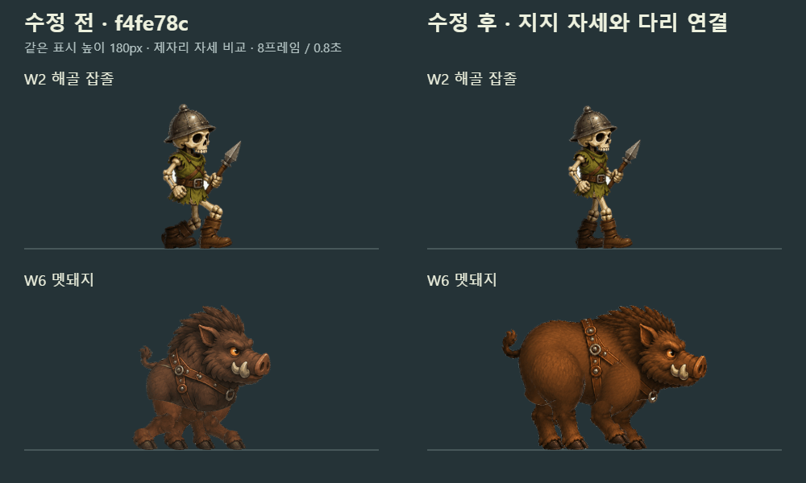
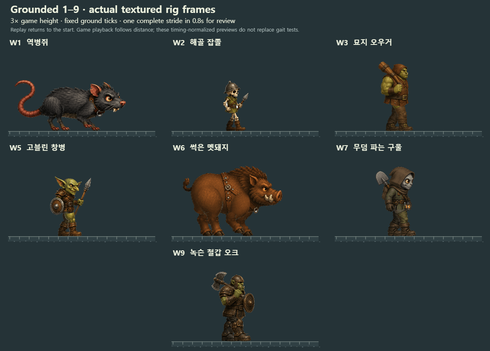
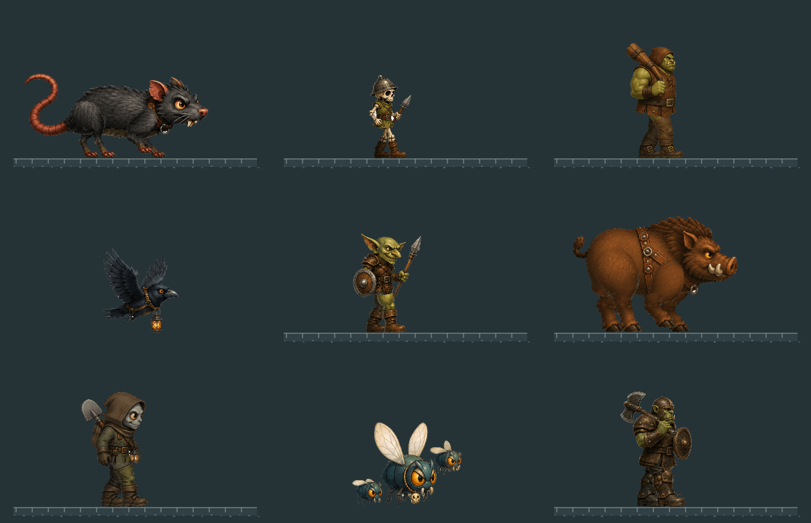
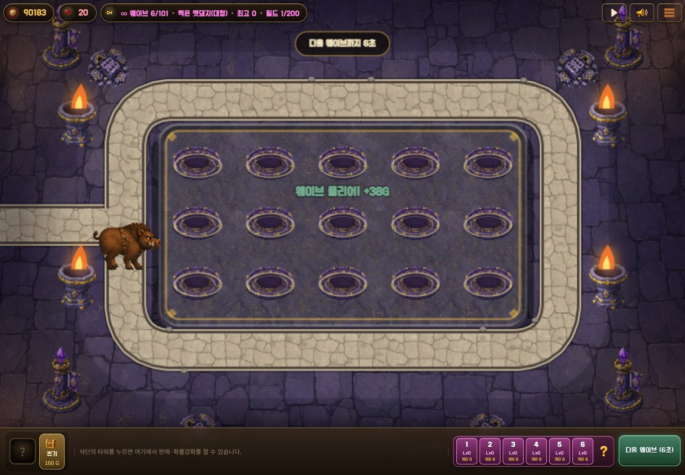
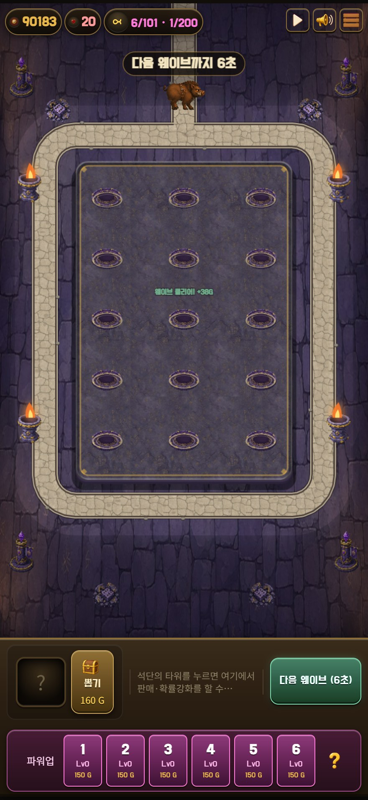

# PR #29 · 지상 몬스터 자세·다리 연결 재작업

검증일: 2026-09-07. 사용자 GIF 검토에서 확인된 **두 발 캐릭터의 계속 굽힌 무릎, 네 발 캐릭터의 부자연스러운 다리 연결**을 수정했다.

`f4fe78c`에서 양발 교대 검사는 통과했지만, 낮게 고정한 골반 때문에 지지 무릎이 계속 굽혀졌다. 실제 지지 각도는 종별 약 91~132°였다(180°가 곧게 편 다리). 멧돼지 원본도 가로 몸통·엉덩이보다 직립한 가슴에 가까웠고, 몸통 덮개가 가까운 어깨·허벅지 연결을 가렸다. 이전 보고서의 자연스러운 관절 연결 판정은 철회한다. 이전 `8118aa5`의 중심점 안정화 결과 역시 양발 교대나 해부학적 자연스러움을 증명하지 못한다. 아래 수정본과 검증 결과가 두 이전 지상 보행 판정을 대체한다.

## 바뀐 제작·보행

- **W2·3·5·7·9 두 발 캐릭터:** 지지 다리 길이에 맞춰 골반 높이를 계산한다. 지지 무릎은 펴고, 옮기는 다리는 무릎을 굽혀 몸 아래를 통과한다. 지지 중간에 골반이 올라갔다가 다음 착지에서 내려오도록 부드러운 높이 곡선을 사용한다. 가까운/먼 다리의 길이 차이는 최초 한 번만 보정하며 프레임별로 늘이지 않는다.
- **W1 쥐·W6 멧돼지:** 먼저 다리가 붙어 있는 완성형 중립 원화를 만들고, 이를 기준으로 몸통·앞다리·뒷다리 부품을 제작했다. 가로 갈비통과 엉덩이를 온전히 유지하고, 짧은 앞다리는 어깨에, 넓은 뒤 허벅지는 골반 바깥에 연결했다. 뒷다리는 무릎(stifle) 뒤의 발목(hock) 꺾임과 발을 구분한다.
- 사족은 먼 다리 → 몸통 → 가까운 어깨·허벅지 순서로 겹친다. 부착 부위 가장자리만 부드럽게 처리한다. 가까운 뒷발 → 가까운 앞발 → 먼 뒷발 → 먼 앞발이 차례로 착지하는 네 박자 걸음이다. 연속 리그 경로의 목표 접지 비율은 65%이며, 저장한 8개 자세에서는 각 발이 6자세(75%) 동안 접지하고 매번 세 발이 지지한다.
- 지상 **7종 × 8프레임, 4열×2행**. 같은 좌표와 배율로 분할·합성하며, 개별 프레임 중심 보정과 런타임 공통 상하 흔들림은 적용하지 않는다. 실제 전진 거리·표시 크기·새 원본 보폭에 맞춰 재생한다.
- **W4 까마귀·W8 파리의 4프레임 날갯짓은 유지**했다. **W10은 기존 120px 정지 보스**로, 걷기 검증 대상이 아니다.
- 온전한 털·피부, 둥근 실루엣과 의상·장비 중심의 판타지 게임 캐릭터 수위를 유지했다. 새 고어·상처·부패 표현을 넣지 않았다.

## 실제 검증 결과

중립 합성본을 완성형 원화와 비교한 뒤 8개 자세, 확대 GIF, 실제 게임 크기를 각각 검토했다. 수치 검사는 시각 검토와 별개다. 아틀라스 SHA와 관절 좌표가 맞는다는 이유로 해부학적 자연스러움을 자동 판정하지 않는다.

- 지상 7종 **56프레임 / 다리 18개 / 완전한 접지 구간의 포즈 88개**를 실제 게임의 `drawImage` 호출에서 확인했다. 대체 텍스처 주입 없이 운영 자산을 사용했다.
- 두 발 캐릭터의 저장된 지지 포즈 무릎 **167.875~168.000°**. 주기당 256개 중간 자세도 검사했으며 지지 각도 **162.439~169.955°**, 도달 불가능한 관절 없음. 다리를 옮길 때 최소 무릎 각도는 종별 **119.257~119.633°**다.
- 골반 상승 **4.859~5.358 원본 px**. 뼈 길이와 몸통 안의 부착 위치를 유지한다. 사족은 네 개별 착지와 주기 끝→시작을 넘는 접지 구간도 검사한다.
- 원본 발 텍스처 **144개**, 실제 로더 발 텍스처 **144개**, 아틀라스 SHA **7개** 일치.
- 실제 게임 크기의 발 들림 **1.866~2.657px**. 접지 포즈별 첫 관측 사이 수평 편차 최대 **1.121px**, 수직 편차 **0px**. 기절 정지·50% 감속·경로 순환 **7종 모두 통과**.
- 데스크톱 **1240×860**, 휴대폰 크기 **440×956**에서 **W1~11** 확인. 지상 56프레임·비행 8프레임, W10 정지 보스, W11 기존 폴백을 포함해 각 화면 77장 캡처. 새 인피니티 아트·페이지 오류 **0건**.
- 시트 회귀 **13/13**, 리그 입력 회귀 **4/4**. 잘못된 보행·관절·부착·접지 사례 **27종**, 발 텍스처 누락/이동 사례, 로더 오류 상황 **14종** 거부 검사 통과.
- 최종 게임 PNG **19개 재생성, SHA256 불일치 0개**. 데스크톱·휴대폰 스모크와 구문 검사 통과. 스모크에는 기존 선택적 미납품 리소스의 404 콘솔 진단 178건이 남으며, 새 인피니티 아트 오류와 구분한다.

[실제 게임 보행 수치](evidence/final-gait-summary.json) · [전체 관측 기록](evidence/ground-gait-check.json) · [이전·현재 관절 각도](evidence/anatomy-comparison.json) · [화면별 검사](evidence/browser-test-summary.json) · [테스트 요약](evidence/test-summary.json)

## GIF와 시각적 한계

왼쪽 `f4fe78c`, 오른쪽 이번 수정본. 같은 표시 높이 180px의 제자리 자세 비교다.



다음은 실제 게임 로더의 텍스처다. 지상 7종을 게임 높이 3배, 비교용 주기 0.8초로 보여 준다. 바닥 눈금은 고정되어 있고, 반복 시작 시 캐릭터 위치는 처음으로 돌아간다. 실제 게임 주기는 이동 속도·크기에 따라 달라진다.







현재 방식은 몸통·꼬리 변형이 제한된 **8자세 컷아웃 애니메이션**이다. 멧돼지의 어깨·허벅지에는 확대 시 가는 합성 경계가 남는다. 게임 크기에서는 덜 보이지만 완전히 이음새 없는 작화라고 판정하지 않는다. 손으로 모든 프레임을 그린 전신 애니메이션의 유연함과는 차이가 있다.

접지 편차는 오른쪽으로 가는 수평 구간의 **포즈별 첫 관측값**이다. 8프레임을 계단식으로 재생하므로 관측 사이에도 발이 완전히 고정된다는 뜻은 아니다. 꺾이는 경로의 접지와 네이티브 실기기는 해당 측정 범위에 포함하지 않는다. 휴대폰 검증은 Chromium 화면 에뮬레이션이다.

## 재현

저장소 루트에서 Node, sharp, playwright-core와 Chrome/Chromium을 사용한다. 기본 재생성은 `gen/`에만 쓴다. 원본 SHA, 부품을 가르지 않는 분할 여백, 관절 도달 범위, 지지 각도, 시트 가장자리 잘림을 검사한다. 별도 완성형 원화는 사람이 비교하기 위한 자료이며 자동 SHA 검사의 대상은 실제 사용한 부품 아틀라스다.

```sh
npm ci
npm install --no-save --package-lock=false playwright-core
node tools/art-review/pr29-gait/rebuild.mjs
node --test tools/sheet-test.mjs tools/rig-test.mjs
node tools/e2e/ground-gait-check.cjs --self-test
node tools/e2e/walk-jitter.js --self-test
python serve.py
# 다른 터미널: E2E_BASE_URL, E2E_OUTPUT_DIR를 필요에 맞게 설정
node tools/e2e/ground-gait-check.cjs
node tools/e2e/walk-jitter.js
node tools/e2e/inf-art-check.js 11
node tools/e2e/inf-art-check.js 11 --phone
node tools/e2e/single-smoke.js
node tools/e2e/walk-preview.cjs
```

[이번 원화·부품 생성 프롬프트](anatomy-prompts.json) · [이전 부품 프롬프트](prompts.json) · [원본](sources/) · [관절·분할 설정](rig-config.json) · [중립 및 프레임별 관절](rig-manifest.json) · [재생성](rebuild.mjs)

`rebuild.mjs`는 중립 합성 PNG와 리그 디버그 GIF도 출력한다. `tools/art-review/pr29/rebuild.mjs`는 같은 진입점으로 연결한다. W4·W8·W10의 원본은 이전 폴더에서 사용하며, 최종 PNG 19개를 커밋 파일과 SHA256으로 비교한다.

## 메인 반영 시 이미지 캐시 갱신

1~10웨이브의 정지컷·보행 시트·보스 URL에 `?v=92`를 추가하고 `content.js` 로드 URL도 `v=92`로 갱신했다. 이미지 파일명은 같아도 이전 캐시와 다른 주소로 요청한다. 아트 픽셀·캐릭터 설정·보폭과 미납품 웨이브의 URL 정책은 유지한다.

실제 Chrome 요청 **19/19**에서 v92·HTTP 200·검증된 PNG의 SHA256 일치를 확인했다. 지상 7종×8프레임, 비행 2종×4프레임과 보스 정지컷의 로드가 정상이며 기존 `walk-jitter.js` 검사도 통과했다. 이는 캐시 주소와 로더 검증이며 새로운 전신 시안의 보행 합격 판정이 아니다.

[v92 브라우저 요청 기록](evidence/cache-v92-browser-assets.json) · [v92 시트 로더 검사](evidence/cache-v92-walk-jitter.json) · [별도 전신 시안 전체](../pr29-fullbody/README.md)
