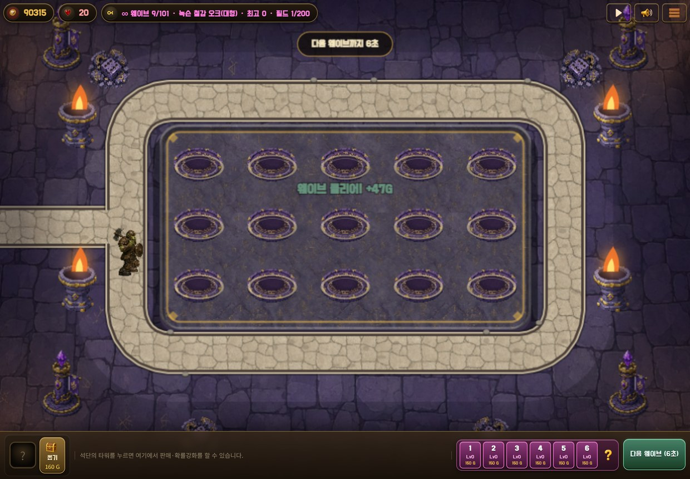
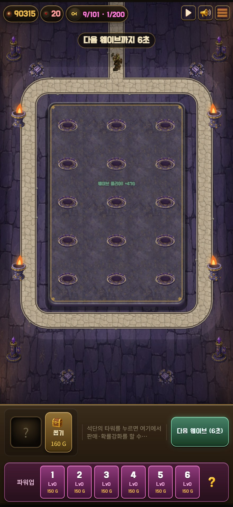

# PR #29 · 지상 몬스터 보행 재작업

검증일: 2026-09-07. 사용자 GIF 검토에서 지적된 **다리의 앞뒤 순서가 바뀌지 않는 문제**를 수정했다.

이전 `8118aa5`의 중심점·발 높이 안정화 검사는 시트의 떨림을 확인했을 뿐, 양발 교대를 증명하지 못했다. 당시 “접지·통과 자세가 보인다”는 지상 보행 판정을 철회한다. 이 보고서와 새 GIF가 해당 판정을 대체한다.

## 수정한 동작

- W1 쥐, W2 해골, W3 오우거, W5 고블린, W6 멧돼지, W7 구울, W9 오크: 각 **8프레임 / 4열×2행**, 총 56프레임으로 교체했다. 잘못된 지상 2×2 시트는 런타임 경로에서 제거했다.
- 두 발 캐릭터는 가까운/먼 다리를 고정된 개별 부품으로 추적한다. 각 발이 접지 → 뒤로 이동 → 들기 → 몸 아래 통과 → 앞에 착지한다. 반 주기 뒤에는 지지 발이 바뀐다.
- 쥐·멧돼지는 앞다리의 부착 위치와 뒷다리의 부착 위치를 유지하고, 각 쌍의 가까운/먼 발이 앞뒤 순서를 바꾼다. 가까운 앞발과 먼 뒷발이 함께 지지하는 대각선 교대 동작이다.
- 내장 imagegen으로 몸통·다리의 그림 부품을 다시 만들고, 관절 회전과 두 뼈대 IK로 시트에 굽는다. 프레임마다 다리를 새로 그려 같은 다리가 계속 앞에 남는 문제를 없앴다. 둥근 관절 연결과 몸통의 알파 덮개로 부품 경계를 다듬었다.
- 시트 전체의 좌표·크기를 고정한다. 개별 프레임 중심 보정과 런타임의 공통 상하 흔들림을 적용하지 않는다.
- 실제 전진 거리를 원본 보폭과 표시 높이로 환산해 프레임을 선택한다. 정예의 확대 크기도 반영한다. 기절하면 멈추고, 둔화하면 보행도 느려지며, 경로 순환 시 누적 보행 거리는 이어진다.
- W4 까마귀와 W8 파리의 기존 4프레임 날갯짓을 보존했다. W10은 기존 설계대로 **120px 정지 보스**이며 걷는다고 판정하지 않는다.
- 건강한 털·온전한 피부, 의상·장비, 큰 눈과 간결한 실루엣을 유지했다. 고어·상처·부패·실사 공포를 새로 넣지 않았다.

## 검증 범위와 증거

`ground-gait-check.cjs`는 중심점 대신 다리별 발바닥 좌표, 양발 순서 반전, 접지/들기 위상, 원본 및 게임 로더의 실제 발 픽셀을 검사한다. 실제 게임의 `drawImage` 호출에서 선택된 프레임을 관찰한다.

- 지상 7종의 56프레임, 다리 18개, 다리마다 4개 접지 자세를 확인한다.
- 원본 발 텍스처와 로딩 후 발 텍스처 각각 144개를 확인한다.
- 지지 발의 바닥 높이와 전진 거리 대비 위치, 들린 발의 높이, 기절·50% 감속·경로 순환을 검사한다.
- 정적 포즈, 몸 전체 이동, 두 다리 동시 진행, 들림 누락 등 잘못된 보행 13종과 발 텍스처 누락·위치 오류를 거부하는 자체 검사를 포함한다.
- 데스크톱 1240×860, 폰 크기 440×956에서 W1~11의 실제 프레임, 아트 키·이름·크기·이동을 검사한다. W10 정지 보스와 W11 기존 폴백도 포함한다.

최종 실행 수치는 [evidence](evidence/)에 보관한다. 접지 수평 편차는 **관찰한 접지 자세 사이의 측정치**다. 8프레임을 계단식으로 선택하므로 프레임 사이에도 발이 완전히 연속 고정된다고 주장하지 않는다. 꺾이는 경로와 실기기 네이티브 앱은 별도 보행 미끄러짐 측정 범위에 포함하지 않는다. 폰 검증은 Chromium 화면 에뮬레이션이다.

최종 재실행: 게임 크기 발 들림 **3.893~6.015px**, 관찰한 접지 자세의 수평 위치 편차 최대 **1.182px**, 수직 편차 **0px**. 7종 모두 기절·50% 감속·경로 순환 통과, 새 아트·런타임 오류 **0건**. 시트 회귀 **13/13**, 리그 입력 회귀 **4/4**, 로더 실패 상황 **14개** 검증 통과. 최종 PNG **19개 재생성 / SHA256 불일치 0개**. 스모크는 데스크톱·폰 모두 통과했으며 기존 선택적 미납품 리소스의 404 콘솔 진단 178건은 남아 있다.

## 시각 검토

아래 첫 GIF는 고정 바닥 눈금에 대해 전진하는 실제 로더 텍스처를 게임 높이의 3배로 보여 준다. 지상 7종을 비교하기 위한 0.8초 주기이며, 실제 게임 주기는 이동 속도와 몬스터 크기에 따른다. 반복 시작 시 위치가 되돌아가는 지점은 미리보기의 재시작이다.





몸통을 고정한 간결한 컷아웃 애니메이션이다. 손으로 모든 몸통 변형을 그린 애니메이션과 같은 유연함을 의미하지 않는다. 확대 이미지와 실제 게임 크기에서 양발 교대·들림·관절 연결·실루엣·과도한 혐오 표현을 따로 검토했다.

## 재현

저장소 루트에서 Node, sharp, playwright-core와 Chrome/Chromium을 사용한다. 원본 이미지 SHA256, 부품의 빈 분할 여백, 연결 불가능한 관절, 시트 가장자리 잘림을 출력 전에 검사한다. 기본 재생성은 `gen/`에만 쓴다.

```sh
npm ci
npm install --no-save --package-lock=false playwright-core
node tools/art-review/pr29-gait/rebuild.mjs
node --test tools/sheet-test.mjs
node --test tools/rig-test.mjs
node tools/e2e/ground-gait-check.cjs --self-test
node tools/e2e/walk-jitter.js --self-test
python serve.py
# 다른 터미널: E2E_BASE_URL, E2E_OUTPUT_DIR를 필요에 맞게 설정
node tools/e2e/ground-gait-check.cjs
node tools/e2e/walk-jitter.js
node tools/e2e/inf-art-check.js 11
node tools/e2e/inf-art-check.js 11 --phone
node tools/e2e/single-smoke.js
node tools/e2e/walk-preview.cjs
```

[부품 생성 프롬프트](prompts.json) · [원본 7장](sources/) · [관절·분할 설정](rig-config.json) · [프레임별 발바닥·관절 기록](rig-manifest.json) · [재생성](rebuild.mjs)

기존 `tools/art-review/pr29/rebuild.mjs`도 새 재생성 진입점으로 연결한다. W4·W8·W10의 기존 원본은 이전 폴더에서 사용한다. 최종 게임 PNG 19개를 다시 만들고 커밋 파일과 SHA256을 비교한다.
