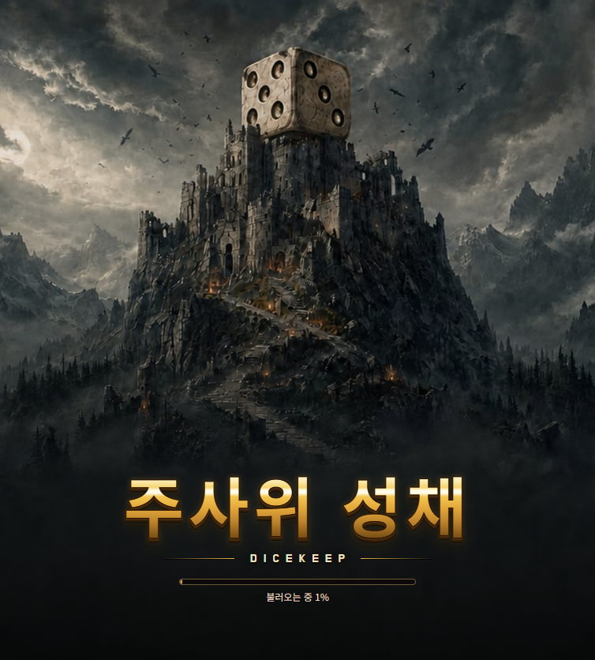
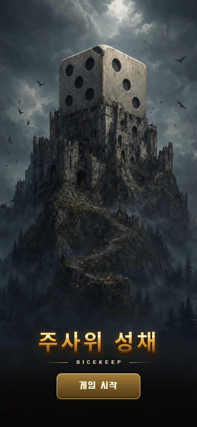

# PR #29 — 로딩 배경 주사위 수정

기존 배경은 주사위의 인접한 두 면이 모두 5로 보였습니다. 세로·가로 배경 모두 화면 왼쪽 면을 **5(네 모서리+중앙)**, 오른쪽 면을 **3(대각선)**으로 수정했습니다. 실제 D6에서 가능한 인접 면 조합입니다. 보이지 않는 반대편 면의 눈은 이 이미지로 확인할 수 없습니다.

윗모서리에서 작은 돌 조각이 빠진 형태와 가는 균열을 더했습니다. 주사위의 형태와 눈을 유지하는 가벼운 손상입니다. 성·산·폭풍 구름·새와 어두운 하단 UI 공간을 유지했습니다. 이미지 생성 편집이므로 주변의 세부 질감까지 원본과 픽셀 단위로 동일하지는 않습니다.

## 게임 반영

- `ui/title-keyart-p.jpg`: 1400×2100, 세로 화면.
- `ui/title-keyart-l.jpg`: 2400×1000, 가로 및 정사각형에 가까운 화면.
- `ui/title-keyart-l-blur.jpg`: 480×200, 같은 가로 원화에서 만든 흐린 양옆 배경.
- 이미지 URL과 HTML preload를 `v=91`로 맞추고, 이를 설정하는 `game.js`의 로드 URL도 `v=91`로 갱신했습니다.
- 기존 화면 비율 분기, 제목, 로딩 바, 시작 버튼 및 게임 동작은 변경하지 않았습니다.

## 원화와 재생성

기준 원본은 커밋 `f9038af528dc610384f545f5c055bf9abb151f4a`의 `ui/title-keyart-p.jpg`, `ui/title-keyart-l.jpg`입니다. 편집에는 내장 imagegen을 사용했습니다.

- [첫 편집 프롬프트](prompts.json): 세로 최종 원화 및 가로 1차 원화.
- [가로 모서리 보정 프롬프트](refinement-prompt.json): 가로 원화의 작은 파손이 읽히도록 한 번 더 보정.
- `sources/portrait-d6.png`, `sources/landscape-d6.png`: 최종 원화.
- `sources/landscape-d6-initial.png`: 가로 모서리 보정의 입력 원화.

저장된 원화에서 런타임 JPEG 세 장을 다시 인코딩합니다. 이미 완성된 구도이므로 기존 keyart-build의 페이드·가로 확장을 중복 적용하지 않습니다.

```sh
npm ci
node tools/art-review/pr29-keyart/rebuild.mjs
```

출력은 `gen/pr29-keyart/`에 저장됩니다. [자산 기록](evidence/asset-manifest.json)의 크기·SHA256으로 런타임 파일과 비교할 수 있습니다. 이미지 생성 자체는 비결정적이며, 이 재생성 검증은 저장된 최종 PNG에서 JPEG를 인코딩하는 단계에 대한 것입니다.

## 화면 검증

393×852 세로, 첨부 화면과 비슷한 754×836, 데스크톱 1280×800, 휴대폰 가로 852×393에서 로딩·타이틀 **8장**을 캡처했습니다. [검증 요약](evidence/summary.json)과 [전체 기록](evidence/keyart-d6-check.json)을 저장했습니다.

- 네 화면 모두 실제 게임의 로딩 상태와 활성화된 시작 버튼까지 도달했습니다.
- 키아트 응답 **11/11**이 최종 JPEG의 SHA256과 일치했습니다. 이미지 디코딩, `v=91`, 활성 preload와 표시 배경 URL의 정확한 일치를 확인했습니다.
- 키아트·페이지 오류, 제목·로딩 바·버튼의 화면 밖 넘침 **0건**입니다.
- 최종 PNG에서 JPEG **3장**을 재생성하여 런타임 파일과 SHA256 모두 일치했습니다. JavaScript 구문과 `git diff --check`도 통과했습니다.
- 키아트와 무관한 기존 리소스 HTTP 404는 화면별 **85건**으로 별도 기록했습니다. 전체 게임 리소스에 오류가 전혀 없다는 판정은 아닙니다.

눈 개수·모서리 파손은 원화 확대와 게임 화면을 시각 검토했습니다. 브라우저 수치만으로 눈 개수나 미감을 판정하지 않습니다. 작은 852×393 화면에서 모서리 파손은 은은하게 보입니다. 휴대폰 크기 검사는 Chromium 뷰포트 에뮬레이션이며 실제 휴대폰 기기 검사는 아닙니다.

로딩 캡처 시 정상 PNG 요청을 잠시 대기시킨 뒤 원래 응답을 풀었습니다. 배경 이미지나 게임 자산을 대체 주입하지 않았습니다. 검사에는 `playwright-core`와 로컬 Chrome/Chromium/Edge가 필요합니다. 저장소를 포트 8137에서 정적 서버로 제공한 상태에서 실행합니다.

```sh
node tools/art-review/pr29-keyart/check-loading.cjs
```

기본 결과 경로는 `gen/pr29-keyart-browser/`입니다. 다른 서버는 `E2E_BASE_URL`, 결과 폴더는 `KEYART_OUTPUT_DIR` 환경 변수로 지정할 수 있습니다.




