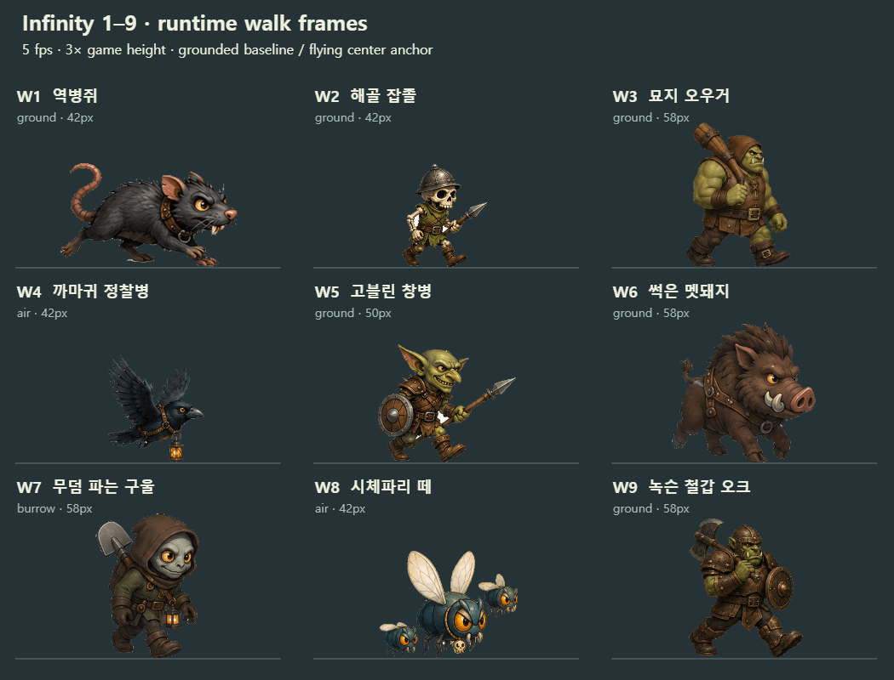
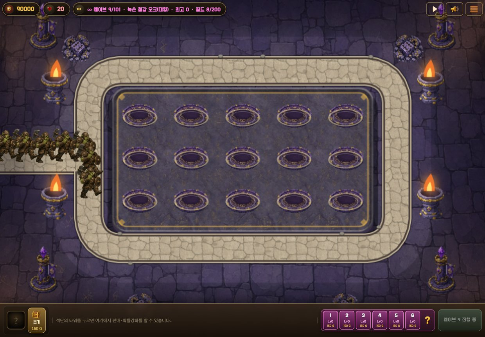
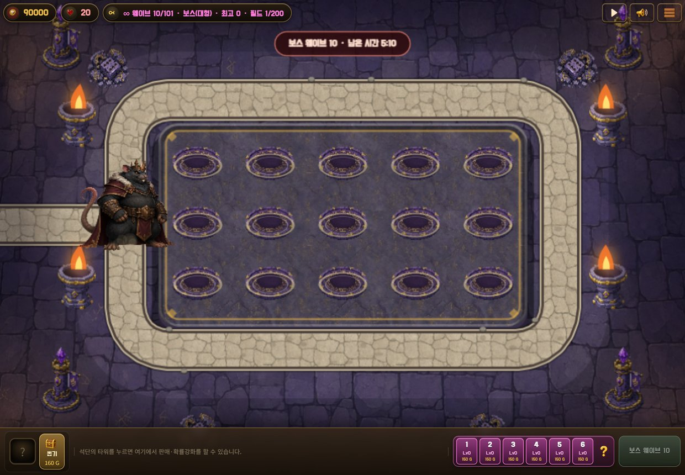
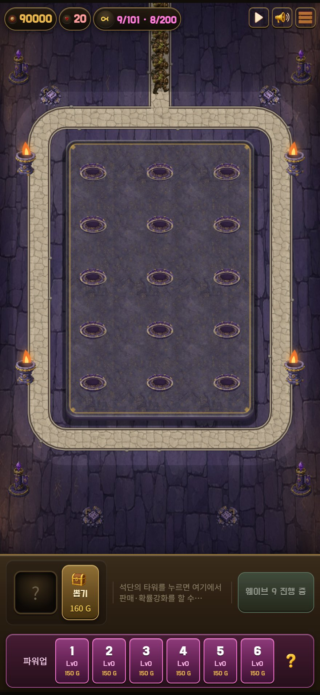
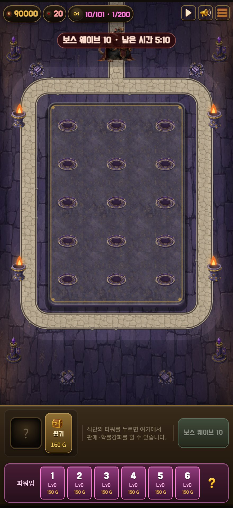

# PR #29 · 인피니티 1~10웨이브 아트 검증
검증일: 2026-09-07. 최초 검토 기준: `c680f592faf22ddfcb467378a99d81b8f8cd8972`.

1~9웨이브는 4프레임 걷기·날갯짓 시트, 10웨이브는 기존 설계의 **120px 보스 정지컷**이다. 10웨이브에 걷기 시트가 있다고 판정하지 않았다.

## 발견 및 수정
기존 시트는 수치상 기준점 정렬 검사를 통과했지만, W8에 다른 몬스터의 머리 조각이 섞여 있고 W9 오크의 머리 윗부분이 잘려 있었다. W1·W3·W6·W7·W10의 상처·부패·뼈 노출도 요청한 캐릭터 수위보다 강했다.

- 1~9 걷기 시트와 동일 캐릭터의 정지컷, 10 보스를 모두 교체했다(게임 PNG 19개). 온전한 피부·털, 간결한 실루엣, 의상·장비 중심의 판타지 게임 캐릭터로 조정했다.
- 칸 간격이 불규칙한 생성 원본을 `sheet-layout.mjs`로 빈 여백에서 분할했다. 절단선이 아트에 닿거나 열 사이 여백이 없으면 저장 전에 실패한다.
- 첫 다중 시트의 W3는 몽둥이가 이웃 칸과 연결되어 제외하고 개별 재생성했다. 첫 W9는 `static` 판정으로 저장을 차단한 뒤 개별 재생성했다. W8도 프레임마다 개체 수가 달라 재생성하여 세 마리를 유지했다.
- W1·2·3·5·6·7·9는 발 기준, W4·8은 중심 기준으로 안정화했다. 고블린의 창과 오크의 머리·무기 등 전체 실루엣이 칸 안에 들어가는지 확인했다.
- 생성 원본은 불투명 체크무늬 또는 흰 배경을 포함한 RGB였다. 명시적인 `--background=checkerboard` 처리 후 최종 PNG의 알파를 확인했다. 원본을 투명 이미지라고 기록하지 않는다.
- 오프라인 도구의 전역 회색 제거를 게임과 같은 가장자리 연결 배경 제거로 바꿔 내부 장비의 회색 하이라이트를 보존했다.
- 날개·등불 고리·삽·도끼·방패 사이에 갇힌 흰 배경 조각은 사람이 검토한 **원본 좌표 21개**를 추가 flood-fill 시작점으로 지정해 제거했다. [background-seeds.json](background-seeds.json)은 리사이즈 전 원본 좌표와 **원본 SHA256**을 기록하며, 원본이 달라지면 처리를 거부한다. 지정하지 않은 내부 하이라이트는 보존한다.
- 빈 프레임·잘못된 격자·정적 시트를 출판 전에 거부하고, E2E가 누락된 시트를 건너뛰어 거짓 성공하지 않도록 했다.
- 고어·신체 훼손·실사 공포 제한을 생성기 공통 규칙과 1~10 묘사에 반영했다. 한국어 이름과 게임 규칙은 유지했다. 11~101 아트를 새로 납품한 것은 아니다.

## 최종 검증
- `node --test tools/sheet-test.mjs`: **13/13** 통과. 내부 하이라이트, 투명도, 빈 프레임, 잘못된 격자, 정적 시트 덮어쓰기 방지, 잘못된 분할선·열 여백, 선택 행 순서, 검토한 배경 시작점의 선택적 제거·좌표·색·모드·원본 SHA256 검증, 단일 정지컷 처리를 검증한다.
- `node tools/e2e/walk-jitter.js --self-test`: 누락·빈 프레임·NaN 등을 포함한 **11개 실패 상황** 검사 통과.
- `node tools/e2e/walk-jitter.js`: **9시트 × 4프레임** 통과. 지상·땅굴 발 높이 편차 모두 **0px**. 공중 중심 y 최대 **0.576px 미만**, 전체 최대 기준점 편차 **0.300% 미만**(허용 2%). 중심 x 최대 **0.708px 미만**. 면적 편차 최대 **1.30% 미만**.
- `node tools/e2e/inf-art-check.js 11` 및 `--phone`: 데스크톱 1240×860, 휴대폰 440×956에서 1~11웨이브 통과. 이름·아트 키·크기·이동·자연스러운 거리 증가·애니메이션 시간 증가와 실제 0~3 프레임 도달을 검증했다. 각 프레임을 기다려 캡처하여 이전 0.4초 간격의 프레임 건너뛰기를 없앴다. W7은 지상에 드러난 상태를 캡처했다.
- W10: `infB10` **120px 정지 보스** 정상. W11: 기존 **대추야자 / cDatefruit / 36px** 폴백 정상.
- `node tools/e2e/single-smoke.js`: 데스크톱·세로 폰 모두 통과. 새 인피니티 아트 요청 오류·pageerror **0건**. 기존 미납품 리소스 404 콘솔 진단 **178건**은 남아 있으며 새 아트 오류와 구분했다.
- `node tools/art-review/pr29/rebuild.mjs`: 커밋된 원본으로 **19개 PNG 재생성, SHA256 불일치 0개**(검증 환경 Node 22 / sharp, 동일 환경 기준).
- 변경 JS 구문 검사와 `git diff --check` 통과.

## 시각 검토와 한계
접지·통과 자세, 반대쪽 다리의 접지·통과 자세, 쥐·멧돼지의 사족 이동과 까마귀·파리의 날개 변화가 보인다. 걷는 동안 프레임이 실제로 바뀌고 전진한다. 아래 GIF는 게임 로더가 만든 실제 프레임을 5fps와 게임 높이의 3배로 보여 준다. 실제 게임 화면은 아래 별도 캡처다.

4프레임 제한 때문에 움직임은 의도적으로 간결하다. 기준점 수치는 보행 해부학이나 모든 신체 부위의 위치를 보증하지 않으며, 비행 실루엣의 높이는 날개 자세에 따라 달라진다. 이번 검증은 로컬 웹 게임과 휴대폰 크기의 Chromium 에뮬레이션이며 실기기 네이티브 앱 검증은 포함하지 않는다.








## 재현
저장소 루트에서 실행한다. Node와 sharp는 저장소 의존성, 브라우저 검증은 `playwright-core`와 Chrome/Chromium/Edge가 필요하다. 브라우저 경로는 자동 검색하거나 `PLAYWRIGHT_CHROMIUM_EXECUTABLE_PATH`로 지정한다.

```sh
npm ci
npm install --no-save --package-lock=false playwright-core
node tools/art-review/pr29/rebuild.mjs
node --test tools/sheet-test.mjs
python serve.py
# 다른 터미널, E2E_OUTPUT_DIR를 저장소 밖의 작업 폴더로 설정
node tools/e2e/walk-jitter.js --self-test
node tools/e2e/walk-jitter.js
node tools/e2e/inf-art-check.js 11
node tools/e2e/single-smoke.js
node tools/e2e/walk-preview.cjs
# E2E_OUTPUT_DIR를 별도 휴대폰 결과 폴더로 바꾼 뒤 실행
node tools/e2e/inf-art-check.js 11 --phone
```

정확한 생성 프롬프트와 내장 image_gen 사용 기록: [prompts.json](prompts.json). 원본: [sources](sources/). 재생성 명령: [rebuild.mjs](rebuild.mjs). 수치·게임 메타데이터·SHA256: [evidence](evidence/).
